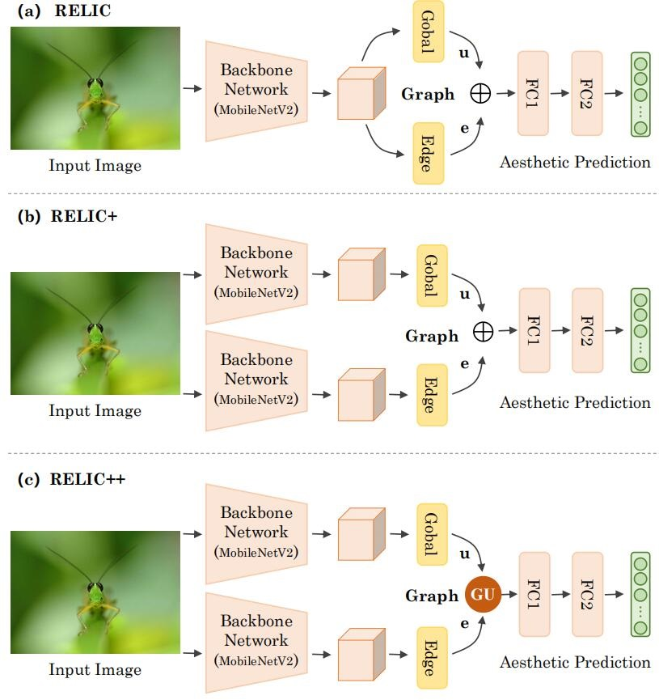
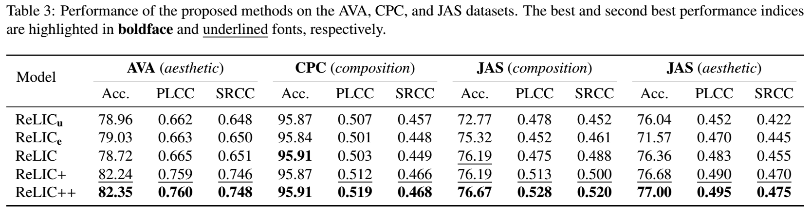

# ReLIC
> Pytorch code for our work "Representation Learning of Image Composition for Aesthetic Evaluation".

## Citation

> Lin Zhao, Meimei Shang, Fei Gao*, et al. Representation Learning of Image Composition for Aesthetic Prediction. Computer Vision and Image Understanding (CVIU), 2020. (under review)

## Framework

## Requirements

- pytorch 
- torchvision
- tqdm
- requests

## Code (folder)

- It contains AVA, CPC, JAS_composition, JAS_aesthetic.
  - AVA: aesthetic prediction on the AVA dataset;
  - CPC: composition prediciotn on the CPC dataset;
  - JAS_composition: composition prediction on the JAS dataset;
  - JAS_aesthetic: aesthetic prediction on the JAS dataset;
- Pretrained models are released in ``pretrain_model``
  - ``e`` denotes ``ReLIC_e``
  - ``u`` denotes ``ReLIC_u``
  - ``ReLIC`` denotes ``ReLIC``
  - ``ReLIC1`` denotes ``ReLIC+``
  - ``ReLIC2`` denotes ``ReLIC++``
- you can change the ``'path_to_model_weight'`` in ``option.py`` and run ``start_check_model`` in ``main.py``
- if you want to train your own models, please run ``start_train`` in ``main.py``  

## Data (folder)

- ``data`` contains the dataset split of three datasets: AVA, JAS, CPC; 
  - [AVA: A Large-Scale Database for Aesthetic Visual Analysis]（http://refbase.cvc.uab.es/files/MMP2012a.pdf）
  - CPC: [The Comparative Photo Composition (CPC) database]（https://www3.cs.stonybrook.edu/~cvl/projects/wei2018goods/VPN_CVPR2018s.html）
  - JAS: [JENAESTHETICS DATASET- A PUBLIC COLLECTION OF PAINTINGS FOR AESTHETICS RESEARCH]（http://www.inf-cv.uni-jena.de/jenaesthetics.html）
- each of them have three files: ``train.csv``, ``test.csv`` and ``val.csv`` 

## Results

## References (selected)

- Amirshahi, S.A., Hayn-Leichsenring, G.U., Denzler, J., Redies, C., 2014a. Jenaaesthetics dataset URL: http://www.inf-cv.uni-jena.de/en/jenaesthetics.
- Amirshahi, S.A., Hayn-Leichsenring, G.U., Denzler, J., Redies, C., 2014b. Jenaesthetics subjective dataset: analyzing paintings by subjective scores, in: European Conference on Computer Vision, Springer. pp. 3–19.
- Deng, Y., Chen, C.L., Tang, X., 2017. Image aesthetic assessment: An experimental survey. IEEE Signal Processing Magazine 34, 80–106.
- Murray, N., Marchesotti, L., Perronnin, F., 2012. Ava: A large-scale database for aesthetic visual analysis, in: IEEE International Conference on Computer Vision and Pattern Recognition, pp. 2408–2415.
- Wei, Z., Zhang, J., Shen, X., Lin, Z., Mech, R., Hoai, M., Samaras, D., 2018. Good view hunting: Learning photo composition from dense view pairs, in: Proceedings of the IEEE Conference on Computer Vision and Pattern Recognition, pp. 5437–5446.
- Ma, S., Liu, J., Wen Chen, C., 2017. A-lamp: Adaptive layout-aware multipatch deep convolutional neural network for photo aesthetic assessment , 4535–4544.
- Talebi, H., Milanfar, P., 2018. Nima: Neural image assessment. IEEE Transactions on Image Processing 27, 3998–4011. doi:10.1109/TIP.2018.2831899.